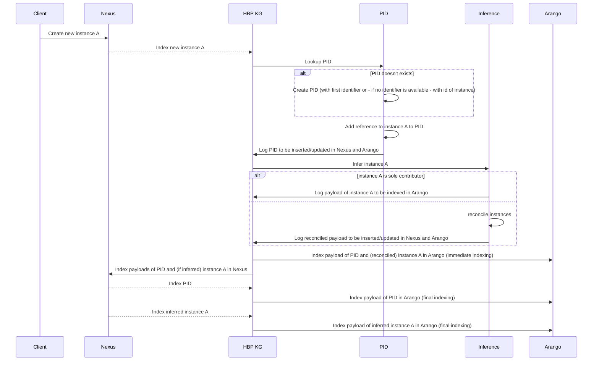

```mermaid
sequenceDiagram
    participant Client
    participant Nexus
    participant HBP KG
    participant PID
    Client->>Nexus: Create new instance A
    Nexus-->>HBP KG: Index new instance A
    HBP KG ->> PID: Lookup PID
    alt PID doesn't exists
           PID->>PID: Create PID (with first identifier or - if no identifier is available - with id of instance)
    end
    PID->>PID: Add reference to instance A to PID
    PID->>HBP KG: Log PID to be inserted/updated in Nexus and Arango
    HBP KG ->> Inference: Infer instance A
    alt instance A is sole contributor
           Inference ->> HBP KG: Log payload of instance A to be indexed in Arango
    else
          Inference ->> Inference: reconcile instances
          Inference ->> HBP KG: Log reconciled payload to be inserted/updated in Nexus and Arango
    end
    HBP KG ->> Arango: Index payload of PID and (reconciled) instance A in Arango (immediate indexing)
    HBP KG ->> Nexus: Index payloads of PID and (if inferred) instance A in Nexus
  Nexus-->>HBP KG: Index PID
  HBP KG ->> Arango: Index payload of PID  in Arango (final indexing)
  Nexus-->>HBP KG: Index inferred instance A
  HBP KG ->> Arango: Index payload of inferred instance A in Arango (final indexing)
```

