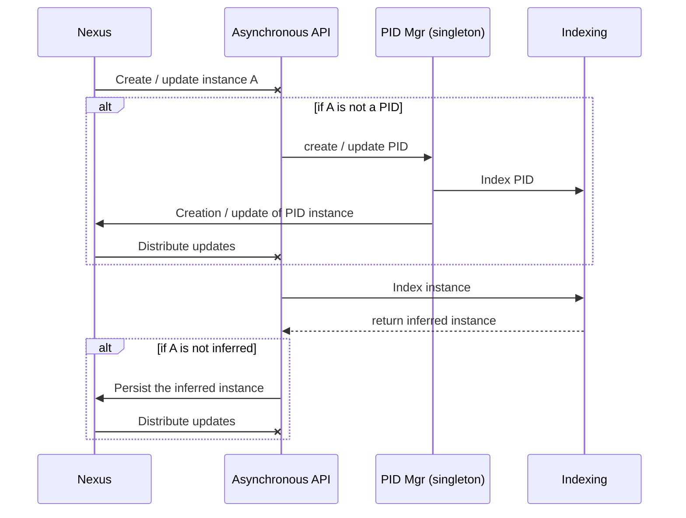

```mermaid
sequenceDiagram

participant Nexus
participant AsyncAPI as Asynchronous API
participant PIDMgr as PID Mgr (singleton)

Nexus -x AsyncAPI:  Create / update instance A
alt if A is not a PID  
     AsyncAPI ->> PIDMgr: create / update PID 
    PIDMgr ->> Indexing: Index PID
    PIDMgr ->> Nexus: Creation / update of PID instance
    Nexus -x AsyncAPI: Distribute updates 
end
AsyncAPI ->> Indexing: Index instance
Indexing -->> AsyncAPI: return inferred instance
alt if A is not inferred
AsyncAPI ->> Nexus: Persist the inferred instance
    Nexus -x AsyncAPI: Distribute updates 
end

```