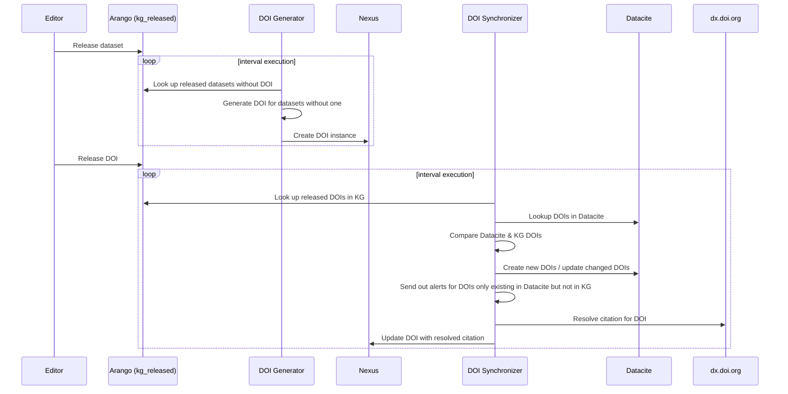

```mermaid
sequenceDiagram
    Editor->>Arango (kg_released): Release dataset
    loop interval execution
    DOI Generator ->> Arango (kg_released): Look up released datasets without DOI
   DOI Generator ->> DOI Generator: Generate DOI for datasets without one
  DOI Generator ->> Nexus: Create DOI instance 
   end
  Editor ->> Arango (kg_released): Release DOI
    loop interval execution
    DOI Synchronizer ->> Arango (kg_released): Look up released DOIs in KG
    DOI Synchronizer ->> Datacite: Lookup DOIs in Datacite
   DOI Synchronizer ->> DOI Synchronizer: Compare Datacite & KG DOIs
   DOI Synchronizer ->> Datacite: Create new DOIs / update changed DOIs
   DOI Synchronizer ->> DOI Synchronizer: Send out alerts for DOIs only existing in Datacite but not in KG
  DOI Synchronizer ->> dx.doi.org : Resolve citation for DOI
  DOI Synchronizer ->> Nexus: Update DOI with resolved citation
   end 
```