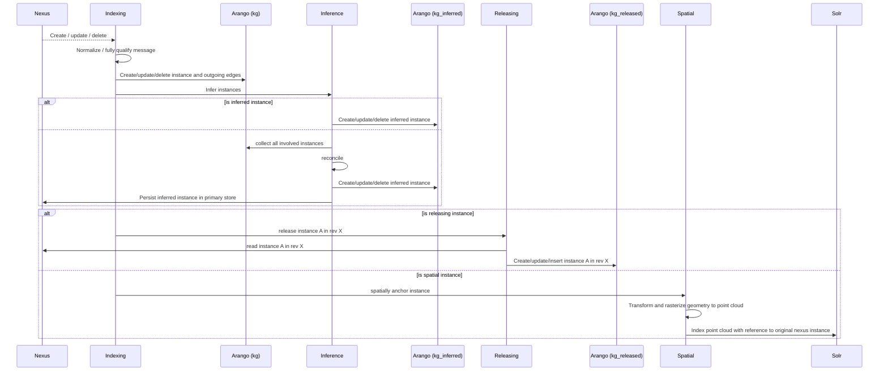

```mermaid
sequenceDiagram
    Nexus-->>Indexing: Create / update / delete
   Indexing->>Indexing: Normalize / fully qualify message
    Indexing->>Arango (kg): Create/update/delete instance and outgoing edges
 Indexing ->> Inference: Infer instances
    alt is inferred instance
         Inference->>Arango (kg_inferred): Create/update/delete inferred instance
    else
         Inference ->>Arango (kg): collect all involved instances
         Inference ->> Inference: reconcile
         Inference->>Arango (kg_inferred): Create/update/delete inferred instance
        Inference ->>Nexus: Persist inferred instance in primary store
   end
  alt is releasing instance
    Indexing ->> Releasing: release instance A in rev X
    Releasing ->> Nexus: read instance A in rev X
   Releasing ->> Arango (kg_released): Create/update/insert instance A in rev X
  else is spatial instance
   Indexing ->> Spatial: spatially anchor instance
  Spatial ->> Spatial: Transform and rasterize geometry to point cloud
  Spatial ->> Solr: Index point cloud with reference to original nexus instance

 
end 
```