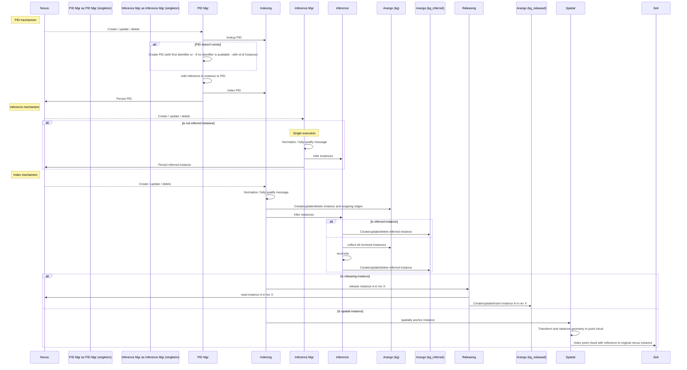

```mermaid
sequenceDiagram

    participant Nexus
   participant PID Mgr as PID Mgr (singleton)
    participant   Inference Mgr as Inference Mgr  (singleton)


Note left of Nexus: PID mechanism
Nexus -->>PID Mgr:  Create / update / delete 
 
PID Mgr ->> Indexing: lookup PID
alt PID doesn't exists
           PID Mgr->>PID Mgr: Create PID (with first identifier or - if no identifier is available - with id of instance)
    end
    PID Mgr->>PID Mgr: Add reference to instance to PID
    PID Mgr->> Indexing: Index PID 
    PID Mgr ->> Nexus: Persist PID


Note left of Nexus: Inference mechanism

   Nexus -->>Inference Mgr:  Create / update / delete 

  alt is not inferred instance

   Note over Inference Mgr:  Single execution
   Inference Mgr->>Inference Mgr: Normalize / fully qualify message
     Inference Mgr ->>Inference: Infer instances
    Inference Mgr ->> Nexus: Persist inferred instance
end

Note left of Nexus: Index mechanism
    Nexus-->>Indexing: Create / update / delete 
   Indexing->>Indexing: Normalize / fully qualify message
    Indexing->>Arango (kg): Create/update/delete instance and outgoing edges
 Indexing ->> Inference: Infer instances
    alt is inferred instance
         Inference->>Arango (kg_inferred): Create/update/delete inferred instance
    else
         Inference ->>Arango (kg): collect all involved instances
         Inference ->> Inference: reconcile
         Inference->>Arango (kg_inferred): Create/update/delete inferred instance
   end
  alt is releasing instance
    Indexing ->> Releasing: release instance A in rev X
    Releasing ->> Nexus: read instance A in rev X
   Releasing ->> Arango (kg_released): Create/update/insert instance A in rev X
  else is spatial instance
   Indexing ->> Spatial: spatially anchor instance
  Spatial ->> Spatial: Transform and rasterize geometry to point cloud
  Spatial ->> Solr: Index point cloud with reference to original nexus instance

 
end 
```