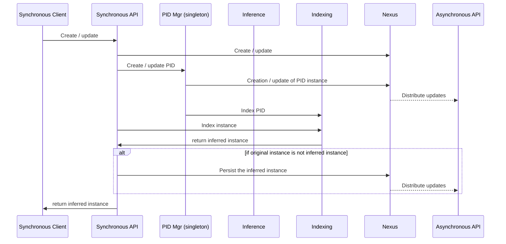

```mermaid
sequenceDiagram

    participant SyncClient as Synchronous Client
    participant SyncAPI as Synchronous API   
   participant PIDMgr as PID Mgr (singleton)
   participant Inference
participant Indexing
   participant Nexus
   participant AsyncAPI as Asynchronous API

SyncClient ->> SyncAPI: Create / update
SyncAPI ->> Nexus: Create / update 
SyncAPI ->> PIDMgr: Create / update PID
PIDMgr ->> Nexus: Creation / update of PID instance
Nexus -->> AsyncAPI: Distribute updates
PIDMgr ->> Indexing: Index PID
SyncAPI ->> Indexing: Index instance
Indexing ->> SyncAPI: return inferred instance
alt if original instance is not inferred instance
SyncAPI ->> Nexus: Persist the inferred instance
Nexus -->> AsyncAPI: Distribute updates
end
SyncAPI ->> SyncClient: return inferred instance


```