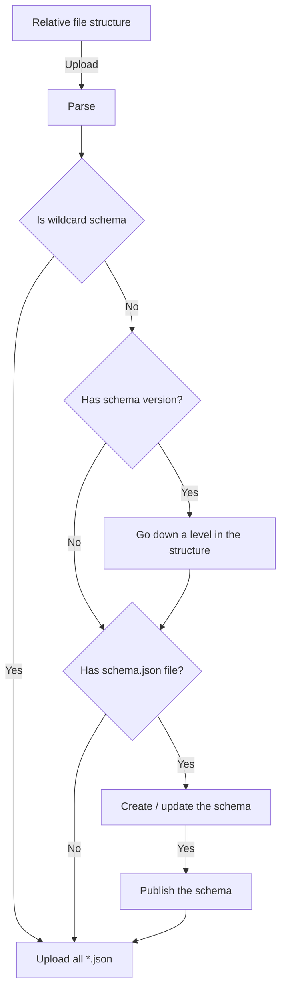
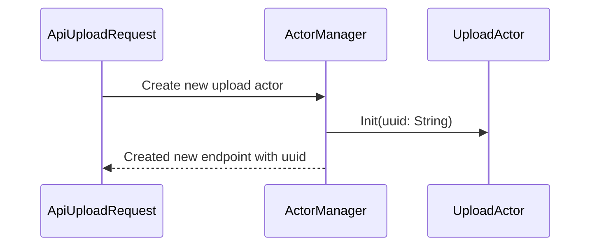
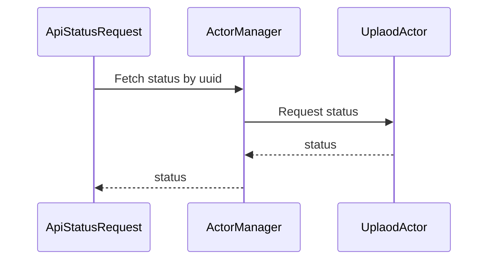

# Nexus Uploader
## Global file process

```mermaid
graph TD;
FileStructure -->|Upload| ApiParser[Parse];
ApiParser --> SchemaWildcard;
SchemaWildcard -->|Yes| UploadFiles;
SchemaWildcard -->|No| SchemaVersion;
SchemaVersion --> |Yes| GoDownALevel;
SchemaVersion --> |No| SchemaJson;
GoDownALevel --> SchemaJson;
SchemaJson --> |Yes| CreateUpdateSchema;
SchemaJson --> |No| UploadFiles;
CreateUpdateSchema --> |Yes| PublishSchema;
PublishSchema --> UploadFiles;


FileStructure[Relative file structure];
ApiParser[Parse];
SchemaWildcard{Is wildcard schema};
SchemaJson{Has schema.json file?};
SchemaVersion{Has schema version?};
CreateUpdateSchema[Create / update the schema];
PublishSchema[Publish the schema];
GoDownALevel[Go down a level in the structure];
UploadFiles[Upload all *.json];
```

## Actor Management

### Requesting an upload

```mermaid
sequenceDiagram;

ApiUploadRequest->>ActorManager: Create new upload actor;
ActorManager->>UploadActor: Init(uuid: String);
ActorManager-->>ApiUploadRequest: Created new endpoint with uuid;
```

### Requesting a status

```mermaid
sequenceDiagram;

ApiStatusRequest->>ActorManager: Fetch status by uuid;
ActorManager->>UplaodActor: Request status;
UplaodActor-->>ActorManager: status;
ActorManager-->>ApiStatusRequest: status;
```
